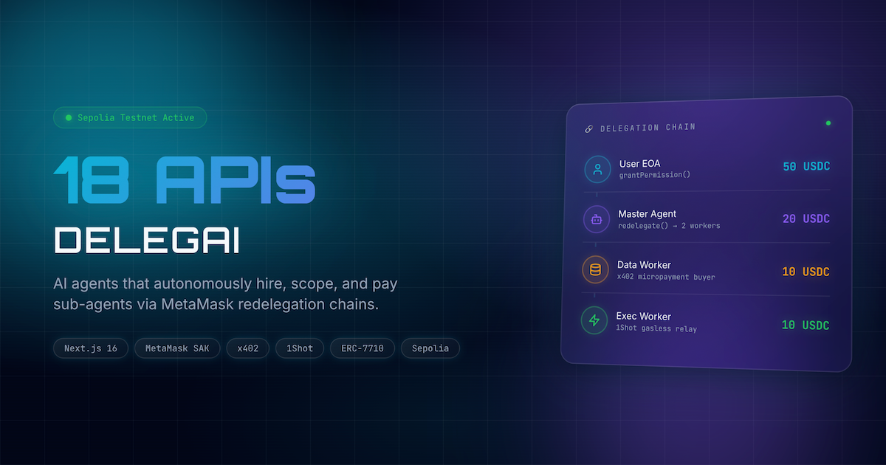
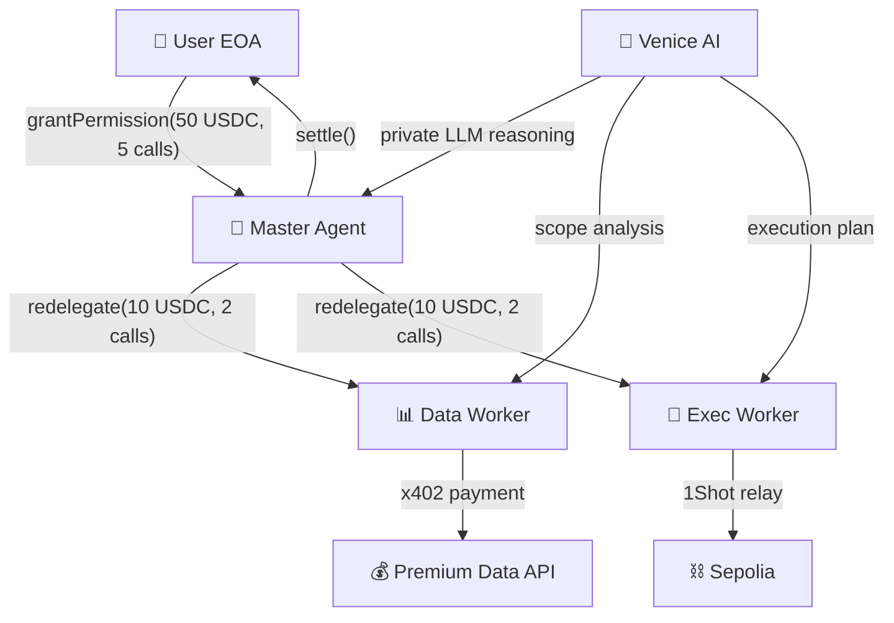

<div align="center">
  <h1>DelegAI 🤖</h1>
  <p><em>AI agents that autonomously hire, scope, and pay sub-agents via MetaMask redelegation chains — the first trustless M2M delegation economy.</em></p>
  

  <br/>

  [](https://delegai.edycu.dev)
  [](https://youtu.be/TODO)
  [](https://delegai.edycu.dev/pitch)
  [](https://www.hackquest.io/hackathons/MetaMask-Smart-Accounts-Kit-x-1Shot-API-x-Venice-AI-Dev-Cook-Off)

  <br/>

  
  
  
  
  
  [](https://github.com/edycutjong/delegai/actions/workflows/ci.yml)

</div>

---

## 📸 See it in Action

<div align="center">
  
</div>

> **One-click delegation flow.** Grant permission → Master Agent scopes → Workers execute → Chain settles. All in <10 seconds.

---

## 💡 The Problem & Solution

AI agents need to spend money — buying compute, fetching premium data, executing on-chain transactions. But trust is binary: grant full wallet access (one bug drains everything) or no access at all (the agent can't act). **There is no middle ground.**

**DelegAI** solves this by building a 3-level hierarchical delegation chain where each redelegation level **NARROWS** scope — the system gets **SAFER** as it grows.

```
User (50 USDC, 5 calls max)
  └── Master Agent (redelegates narrower scope)
      ├── Data Worker (10 USDC, 2 calls) → x402 micropayments
      └── Exec Worker (10 USDC, 2 calls) → 1Shot gasless relay
```

**Key Features:**
- ⚡ **Constrained Growth:** Worker budgets are cryptographically enforced to never exceed master budgets via ERC-7710 caveats
- 🔒 **x402 Micropayments:** Agents autonomously pay for premium data using HTTP 402 payment protocol
- 🚀 **Gasless Execution:** Workers submit transactions via 1Shot public relayer — zero gas needed
- 🎛️ **Real-Time SOC Dashboard:** Military-grade command center visualization of the entire delegation chain

## 🏗️ Architecture & Tech Stack

| Layer | Technology |
|---|---|
| **Dashboard** | Next.js 16 (App Router), React 19 |
| **Styling** | Tailwind CSS v4 |
| **Agent Runtime** | Next.js API Routes |
| **Smart Accounts** | MetaMask Smart Accounts Kit — 18 API integrations |
| **Payments** | x402 (`@x402/core`, `@x402/evm`) |
| **Agent Intelligence** | Venice AI — private LLM inference (llama-3.3-70b) |
| **Relay** | 1Shot Public Relayer (REST API, OAuth2) |
| **Chain** | Ethereum Sepolia (ChainId: 11155111) |
| **Testing** | Jest |
| **Deploy** | Vercel |



## 🏆 Sponsor Tracks Targeted

| Track | Prize | Key Integration |
|---|---|---|
| **Best A2A Coordination** | $1,500 | 3-level redelegation with `parentDelegation` linking |
| **Best Agent** | $1,500 | Autonomous agent fleet (orchestrator + 2 workers) |
| **Best x402 + ERC-7710** | $1,500 | Full buyer (`@x402/core`) + seller (`@x402/evm`) |
| **Best Use of Venice AI** | $1,500 | Private LLM reasoning in all 3 agents via `callVenice()` |
| **Social Media** | Bonus | @MetaMaskDev integration posts |
| **Feedback** | Bonus | SDK feedback document |

**SDK Surface Used:** 18 integration points across `toMetaMaskSmartAccount()`, `createDelegation()`, `createCaveatBuilder()`, `redeemDelegations()`, `paymentMiddleware`, `relayer_send7710Transaction`, and more. See [ARCHITECTURE.md](docs/ARCHITECTURE.md) for full mapping.

## 🚀 Getting Started

### Prerequisites
- Node.js ≥ 20
- npm

### Installation

```bash
# Clone
git clone https://github.com/edycutjong/delegai.git
cd delegai

# Install
npm install

# Configure
cp .env.example .env.local

# Run (demo mode — no wallet needed!)
npm run dev
```

Open [http://localhost:3000](http://localhost:3000) → click **Start Delegation** to see the full 5-step flow.

> **For Judges:** Demo mode is enabled by default — no MetaMask wallet, testnet funds, or API keys required. The full delegation chain runs with deterministic mock data.

## ⚙️ Environment Variables

Copy `.env.example` to `.env.local` and fill in values for the mode you need.

> **Demo mode** (`DELEGAI_DEMO=true`) requires **no API keys** — all agents run on deterministic mock data.

### Core

| Variable | Required | Default | Description |
|---|---|---|---|
| `NEXT_PUBLIC_CHAIN_ID` | No | `11155111` | Ethereum chain ID (Sepolia) |
| `DELEGAI_DEMO` | No | `false` | `true` = full mock mode, no wallet/keys needed (server) |
| `NEXT_PUBLIC_DELEGAI_DEMO` | No | `false` | Same flag exposed to the browser |
| `DELEGAI_DEMO_SPEED` | No | `normal` | Demo animation pace: `fast` / `normal` / `slow` |
| `NEXT_PUBLIC_BASE_URL` | Live only | — | Your deployed URL — required for x402 callbacks |

### RPC

| Variable | Required | Default | Description |
|---|---|---|---|
| `RPC_URL` | Live only | public Sepolia node | Ethereum Sepolia RPC (Alchemy / Infura / Ankr) |
| `SEPOLIA_RPC_URL` | Scripts only | public Sepolia node | RPC for `scripts/deploy-accounts.ts` and `scripts/test-delegation.ts` |

### MetaMask Smart Accounts

| Variable | Required | Default | Description |
|---|---|---|---|
| `PRIVATE_KEY_USER` | Live only | — | User EOA private key (`0x...`) |
| `PRIVATE_KEY_MASTER` | Live only | — | Master Agent private key |
| `PRIVATE_KEY_DATA_WORKER` | Live only | — | Data Worker private key |
| `PRIVATE_KEY_EXEC_WORKER` | Live only | — | Exec Worker private key |
| `USDC_ADDRESS` | Live only | Circle Sepolia USDC | USDC token contract on Sepolia |

### 1Shot Relay

| Variable | Required | Default | Description |
|---|---|---|---|
| `ONESHOT_API_KEY` | Live only | — | 1Shot API key — [dashboard](https://1shotapi.com) |
| `ONESHOT_API_SECRET` | Live only | — | 1Shot API secret |
| `ONESHOT_CONTRACT_METHOD_ID` | Optional | — | UUID for registered `redeemDelegations` method in 1Shot |
| `ONESHOT_WALLET_ADDRESS` | Live only | zero address | 1Shot relay wallet — exec delegations are issued to this address |
| `ONESHOT_WEBHOOK_URL` | Optional | — | Public URL for 1Shot to POST transaction status callbacks |

### Venice AI

| Variable | Required | Default | Description |
|---|---|---|---|
| `VENICE_API_KEY` | Optional | — | Venice AI API key — [get one](https://venice.ai/settings/api). Without it, agents use pre-scripted fallback strings |
| `VENICE_MODEL` | No | `llama-3.3-70b` | Model to use for agent reasoning |

### x402

| Variable | Required | Default | Description |
|---|---|---|---|
| `X402_FACILITATOR` | No | `https://facilitator.metamask.io` | x402 payment facilitator endpoint |

---

## 🧪 Testing & CI

```bash
npm run lint          # Next.js ESLint
npm run typecheck     # TypeScript strict check
npm run test          # Run Jest suites
npm run test:coverage # Coverage report
npm run ci            # Full CI pipeline (lint + typecheck + test)
```

CI runs on every push via GitHub Actions across Node.js `[20, 22, 24]`.

## 📁 Project Structure

```
delegai/
├── docs/                       # Documentation & assets
│   ├── ARCHITECTURE.md         # 18-point integration map
│   ├── DEMO_SCRIPT.md          # Demo video script
│   ├── ONESHOT_SETUP.md        # 1Shot relay setup guide
│   ├── SDK_FEEDBACK.md         # Feedback for SDK teams
│   └── assets/                 # Generated images & thumbnails
├── scripts/                    # CLI tools
│   ├── deploy-accounts.ts      # Generate deterministic accounts
│   ├── test-delegation.ts      # End-to-end delegation test
│   ├── bench.ts                # Performance benchmarks
│   ├── verify-demo.ts          # Demo mode verification
│   └── check-submission.ts     # Submission readiness check
├── src/
│   ├── app/                    # Next.js 16 App Router
│   │   ├── page.tsx            # Landing page
│   │   ├── dashboard/          # Delegation command center
│   │   ├── api/
│   │   │   ├── delegate/       # Delegation CRUD API
│   │   │   ├── events/         # Server-Sent Events endpoint
│   │   │   ├── premium-data/   # x402-protected data (market-feed, defi-yields)
│   │   │   └── relay/          # 1Shot relay webhook
│   │   └── globals.css         # Tailwind v4 + design tokens
│   ├── components/             # React 19 components
│   │   ├── DelegationTree      # Hierarchical chain viz
│   │   ├── AgentCard           # Agent status cards
│   │   ├── BudgetMeter         # Budget consumption bars
│   │   ├── ActivityFeed        # Live event log
│   │   ├── AddressBadge        # Truncated address display
│   │   └── CaveatBadge         # Caveat type indicators
│   ├── agents/                 # Agent logic
│   │   ├── orchestrator        # Master Agent
│   │   ├── data-worker         # x402 buyer
│   │   └── exec-worker         # 1Shot executor
│   ├── lib/                    # Shared utilities
│   │   ├── delegator           # Smart account + delegation
│   │   ├── relay               # 1Shot API client
│   │   ├── buyer               # x402 buyer flow
│   │   ├── seller              # x402 seller setup
│   │   ├── bundler             # ERC-7710 bundler actions
│   │   ├── venice              # Venice AI client
│   │   └── events              # SSE event emitter
│   └── __tests__/              # Jest test suites (13 files, 100% coverage)
├── public/
│   ├── icon.svg                # DelegAI logo
│   └── pitch/                  # Pitch deck (HTML)
├── .env.example                # Environment template
├── .github/                    # CI workflows
└── README.md                   # You are here
```

## 📄 License

[MIT](LICENSE) © 2026 Edy Cu

## 🙏 Acknowledgments

Built for the **MetaMask Smart Accounts Kit × 1Shot API × Venice AI Dev Cook Off** on HackQuest. Thank you to MetaMask, 1Shot, Venice AI, and the x402 team for the SDK access and documentation.
