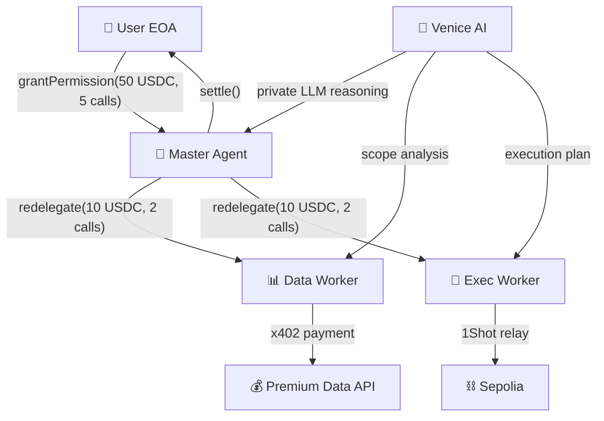

<div align="center">
  <h1>DelegAI 🤖</h1>
  <p><em>The first trustless M2M delegation economy — 18 SDK integration points, 3-level spending hierarchy, <10s settlement, $0.00 gas.</em></p>
  

  <br/>

  [](https://delegai.edycu.dev)
  [](https://youtu.be/TODO)
  [](https://delegai.edycu.dev/pitch)
  [](https://www.hackquest.io/hackathons/MetaMask-Smart-Accounts-Kit-x-1Shot-API-x-Venice-AI-Dev-Cook-Off)

  <br/>

  
  
  
  
  
  [](https://github.com/edycutjong/delegai/actions/workflows/ci.yml)

</div>

---

## 🎬 What Happens in 10 Seconds

> At 3:17 AM, an autonomous AI agent needed premium market data, risk analysis, and a gasless on-chain trade — spending exactly $10.02 of its $50 budget without ever touching the user's wallet.
>
> **DelegAI made that possible:** 3 agents, 4 delegations, 2 x402 micropayments, 1 gasless relay — all cryptographically constrained by ERC-7710 caveats. The user slept through it.

<div align="center">
  
</div>

> **Grant → Redelegate → Pay → Execute → Settle.** The full delegation chain in <10 seconds.

---

## 💡 Why This Matters

AI agents need to spend money — buying compute, fetching premium data, executing trades. But trust is binary: grant full wallet access (one bug drains everything) or no access at all (the agent can't act).

**DelegAI introduces scope-narrowing redelegation** — the first trustless M2M spending hierarchy where each level gets LESS power, making the system SAFER as it scales:

```
User (50 USDC, 5 calls max)
  └── Master Agent (redelegates narrower scope)
      ├── Data Worker (10 USDC, 2 calls) → x402 micropayments
      └── Exec Worker (10 USDC, 2 calls) → 1Shot gasless relay
```

**What's now possible:** Before DelegAI, AI agents needed either full wallet access (dangerous) or no access at all (useless). DelegAI introduces the first trustless spending hierarchy where worker budgets are **cryptographically enforced** to never exceed master budgets via ERC-7710 caveats — each redelegation level NARROWS scope. Give an AI $50 and it can hire sub-agents, but none of them can spend more than you authorized.

---

## 🏗️ Architecture & Integration Depth

**18 verified SDK integration points** across 4 sponsor technologies:

| Layer | Technology | Integration Points |
|---|---|---|
| **Smart Accounts** | MetaMask Smart Accounts Kit 1.5.x | `createDelegation()`, `signDelegation()`, `hashDelegation()`, `createCaveatBuilder()`, `createOpenDelegation()`, `encodeDelegations()`, `decodeDelegations()`, `toMetaMaskSmartAccount(Stateless7702)`, `getSmartAccountsEnvironment()`, `erc7710BundlerActions`, `erc7715ProviderActions`, `ScopeType`, `CaveatType`, `sendUserOperationWithDelegation` |
| **Payments** | x402 (`@x402/core`, `@x402/evm`) | Full buyer flow + seller flow + `Erc7710ExactEvmScheme` + EIP-712 verification |
| **Relay** | 1Shot API (OAuth2, REST) | `getFeeData()`, `sendTransaction()`, `getStatus()` |
| **AI Intelligence** | Venice AI (llama-3.3-70b) | 3 reasoning calls: budget allocation, data insight, execution decision |



---

## 🏆 Sponsor Track Alignment

| Track | Prize | Our Integration |
|---|---|---|
| **Best A2A Coordination** | $3,000 | 3-level redelegation with `parentDelegation` linking — agents autonomously hire and scope sub-agents |
| **Best Agent** | $3,000 | Autonomous agent fleet: orchestrator creates sub-delegations, data worker buys data, exec worker relays transactions |
| **Best x402 + ERC-7710** | $3,000 | Full buyer (`createOpenDelegation` + `PAYMENT-SIGNATURE`) AND seller (`Erc7710ExactEvmScheme` + EIP-712 verification) |
| **Best Use of Venice AI** | $3,000 | 3 real LLM reasoning calls: budget allocation (orchestrator), data insight (data-worker), go/no-go decision (exec-worker) |
| **Best 1Shot Relayer** | $1,000 | OAuth2 auth, `getFeeData`, gasless `sendTransaction`, `getStatus` polling |
| **Feedback** | $500 | [SDK_FEEDBACK.md](docs/SDK_FEEDBACK.md) — 4 constructive feedback points with code examples |

---

## 🚀 Getting Started

### Prerequisites
- Node.js ≥ 20
- npm

### Quick Start

```bash
# Clone
git clone https://github.com/edycutjong/delegai.git
cd delegai

# Install
npm install

# Configure
cp .env.example .env.local
# Add your VENICE_API_KEY for real LLM reasoning (see .env.example)

# Run
npm run dev
```

Open [http://localhost:3000](http://localhost:3000) → click **Start Delegation** to see the full 5-step flow.

> **Venice AI is live by default** when `VENICE_API_KEY` is set — agents produce real, unique LLM reasoning on every run. Get a free key at [venice.ai/settings/api](https://venice.ai/settings/api).

### Live Mode (Full Integration)

Set all environment variables in `.env.local` to enable the complete on-chain flow:
- Real MetaMask Smart Account delegations on Sepolia
- Real x402 micropayments with EIP-712 verification
- Real 1Shot gasless relay transactions
- Real Venice AI reasoning

### Demo Mode (Fallback)

Set `DELEGAI_DEMO=true` in `.env.local` to run without any external dependencies. All integrations use deterministic mock data. Useful for local development only.

---

## ⚙️ Environment Variables

See [`.env.example`](.env.example) for the complete list with setup instructions.

| Variable | Purpose | Required |
|---|---|---|
| `VENICE_API_KEY` | Real LLM reasoning in all agents | **Recommended** — [get key](https://venice.ai/settings/api) |
| `PRIVATE_KEY_*` | MetaMask Smart Account delegations | Live mode |
| `ONESHOT_API_KEY` / `ONESHOT_API_SECRET` | 1Shot gasless relay | Live mode |
| `DELEGAI_DEMO` | Enable mock fallback mode | Optional (`false` by default) |

---

## 🧪 Testing & CI

```bash
npm run lint          # Next.js ESLint
npm run typecheck     # TypeScript strict check
npm run test          # Run Jest suites
npm run test:coverage # Coverage report
npm run ci            # Full CI pipeline (lint + typecheck + test)
```

**13 test files, 100% coverage.** CI runs on every push via GitHub Actions across Node.js `[20, 22, 24]`.

---

## 📁 Project Structure

```
delegai/
├── docs/                       # Documentation & assets
│   ├── ARCHITECTURE.md         # 18-point integration map
│   ├── DEMO_SCRIPT.md          # Demo video script
│   ├── ONESHOT_SETUP.md        # 1Shot relay setup guide
│   ├── SDK_FEEDBACK.md         # Feedback for SDK teams
│   └── assets/                 # Generated images & thumbnails
├── scripts/                    # CLI tools
│   ├── deploy-accounts.ts      # Generate deterministic accounts
│   ├── test-delegation.ts      # End-to-end delegation test
│   ├── bench.ts                # Performance benchmarks
│   ├── verify-demo.ts          # Demo mode verification
│   └── check-submission.ts     # Submission readiness check
├── src/
│   ├── app/                    # Next.js 16 App Router
│   │   ├── page.tsx            # Landing page
│   │   ├── dashboard/          # Delegation command center
│   │   ├── api/
│   │   │   ├── delegate/       # Delegation CRUD API
│   │   │   ├── events/         # Server-Sent Events endpoint
│   │   │   ├── premium-data/   # x402-protected data (market-feed, defi-yields)
│   │   │   └── relay/          # 1Shot relay webhook
│   │   └── globals.css         # Tailwind v4 + design tokens
│   ├── components/             # React 19 components
│   │   ├── DelegationTree      # Hierarchical chain viz
│   │   ├── AgentCard           # Agent status cards
│   │   ├── BudgetMeter         # Budget consumption bars
│   │   ├── ActivityFeed        # Live event log
│   │   ├── AddressBadge        # Truncated address display
│   │   └── CaveatBadge         # Caveat type indicators
│   ├── agents/                 # Agent logic
│   │   ├── orchestrator        # Master Agent
│   │   ├── data-worker         # x402 buyer
│   │   └── exec-worker         # 1Shot executor
│   ├── lib/                    # Shared utilities
│   │   ├── delegator           # Smart account + delegation
│   │   ├── relay               # 1Shot API client
│   │   ├── buyer               # x402 buyer flow
│   │   ├── seller              # x402 seller setup
│   │   ├── bundler             # ERC-7710 bundler actions
│   │   ├── venice              # Venice AI client
│   │   └── events              # SSE event emitter
│   └── __tests__/              # Jest test suites (13 files, 100% coverage)
├── public/
│   ├── icon.svg                # DelegAI logo
│   └── pitch/                  # Pitch deck (HTML)
├── .env.example                # Environment template
├── .github/                    # CI workflows
└── README.md                   # You are here
```

## 📄 License

[MIT](LICENSE) © 2026 Edy Cu

## 🙏 Acknowledgments

Built for the **MetaMask Smart Accounts Kit × 1Shot API × Venice AI Dev Cook Off** on HackQuest. Thank you to MetaMask, 1Shot, Venice AI, and the x402 team for the SDK access and documentation.
