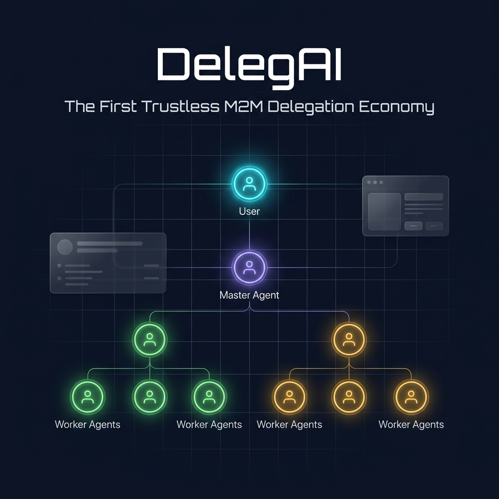
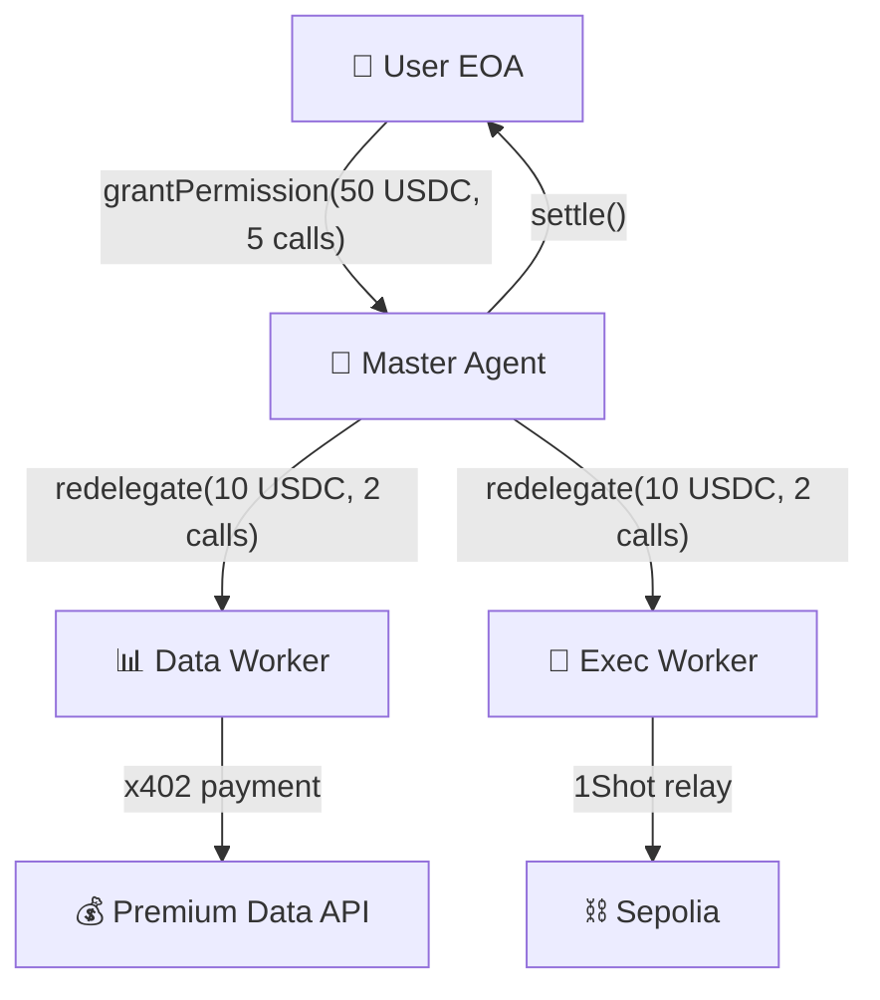

<div align="center">
  <h1>DelegAI 🤖</h1>
  <p><em>AI agents that autonomously hire, scope, and pay sub-agents via MetaMask redelegation chains — the first trustless M2M delegation economy.</em></p>
  

  <br/>

  [](https://delegai.edycu.dev)
  [](https://youtu.be/delegai-demo)
  [](https://delegai.edycu.dev/pitch)
  [](https://www.hackquest.io/hackathons/MetaMask-Smart-Accounts-Kit-x-1Shot-API-Dev-Cook-Off-x-Venice-AI)

  <br/>

  
  
  
  
  
  [](https://github.com/edycutjong/delegai/actions/workflows/ci.yml)

</div>

---

## 📸 See it in Action

<div align="center">
  
</div>

> **One-click delegation flow.** Grant permission → Master Agent scopes → Workers execute → Chain settles. All in <10 seconds.

---

## 💡 The Problem & Solution

AI agents need to spend money — buying compute, fetching premium data, executing on-chain transactions. But trust is binary: grant full wallet access (one bug drains everything) or no access at all (the agent can't act). **There is no middle ground.**

**DelegAI** solves this by building a 3-level hierarchical delegation chain where each redelegation level **NARROWS** scope — the system gets **SAFER** as it grows.

```
User (50 USDC, 5 calls max)
  └── Master Agent (redelegates narrower scope)
      ├── Data Worker (10 USDC, 2 calls) → x402 micropayments
      └── Exec Worker (10 USDC, 2 calls) → 1Shot gasless relay
```

**Key Features:**
- ⚡ **Constrained Growth:** Worker budgets are cryptographically enforced to never exceed master budgets via ERC-7710 caveats
- 🔒 **x402 Micropayments:** Agents autonomously pay for premium data using HTTP 402 payment protocol
- 🚀 **Gasless Execution:** Workers submit transactions via 1Shot public relayer — zero gas needed
- 🎛️ **Real-Time SOC Dashboard:** Military-grade command center visualization of the entire delegation chain

## 🏗️ Architecture & Tech Stack

| Layer | Technology |
|---|---|
| **Dashboard** | Next.js 16 (App Router), React 19 |
| **Styling** | Tailwind CSS v4 |
| **Agent Runtime** | Express 5.x (embedded API routes) |
| **Smart Accounts** | MetaMask Smart Accounts Kit — 18 API integrations |
| **Payments** | x402 (buyer + seller) |
| **Relay** | 1Shot Public Relayer (JSON-RPC) |
| **Chain** | Ethereum Sepolia (ChainId: 11155111) |
| **Testing** | Jest + Supertest |
| **Deploy** | Vercel |



## 🏆 Sponsor Tracks Targeted

| Track | Prize | Key Integration |
|---|---|---|
| **Best A2A Coordination** | $1,500 | 3-level redelegation with `parentDelegation` linking |
| **Best Agent** | $1,500 | Autonomous agent fleet (orchestrator + 2 workers) |
| **Best x402 + ERC-7710** | $1,500 | Full buyer (`@x402/core`) + seller (`@x402/express`) |
| **Social Media** | Bonus | @MetaMaskDev integration posts |
| **Feedback** | Bonus | SDK feedback document |

**SDK Surface Used:** 18 integration points across `toMetaMaskSmartAccount()`, `createDelegation()`, `createCaveatBuilder()`, `redeemDelegations()`, `paymentMiddleware`, `relayer_send7710Transaction`, and more. See [ARCHITECTURE.md](docs/ARCHITECTURE.md) for full mapping.

## 🚀 Getting Started

### Prerequisites
- Node.js ≥ 20
- npm

### Installation

```bash
# Clone
git clone https://github.com/edycutjong/delegai.git
cd delegai

# Install
npm install

# Configure
cp .env.example .env.local

# Run (demo mode — no wallet needed!)
npm run dev
```

Open [http://localhost:3000](http://localhost:3000) → click **Start Delegation** to see the full 5-step flow.

> **For Judges:** Demo mode is enabled by default — no MetaMask wallet, testnet funds, or API keys required. The full delegation chain runs with deterministic mock data.

## 🧪 Testing & CI

```bash
npm run lint          # Next.js ESLint
npm run typecheck     # TypeScript strict check
npm run test          # Run Jest suites
npm run test:coverage # Coverage report
npm run ci            # Full CI pipeline (lint + typecheck + test)
```

CI runs on every push via GitHub Actions across Node.js `[20, 22, 24]`.

## 📁 Project Structure

```
delegai/
├── docs/                   # README assets (hero, screenshots)
├── src/
│   ├── app/                # Next.js 16 App Router
│   │   ├── page.tsx        # Landing page
│   │   ├── dashboard/      # Delegation command center
│   │   └── globals.css     # Design system tokens
│   ├── components/         # React 19 components
│   │   ├── DelegationTree  # Hierarchical chain viz
│   │   ├── AgentCard       # Agent status cards
│   │   ├── BudgetMeter     # Budget consumption bars
│   │   └── ActivityFeed    # Live event log
│   ├── agents/             # Agent logic
│   │   ├── orchestrator    # Master Agent
│   │   ├── data-worker     # x402 buyer
│   │   └── exec-worker     # 1Shot executor
│   └── lib/                # Shared utilities
│       ├── delegator       # Smart account + delegation
│       ├── relay           # 1Shot API client
│       ├── buyer           # x402 buyer flow
│       └── seller          # x402 seller setup
├── .env.example            # Environment template
├── .github/                # CI workflows
├── ARCHITECTURE.md         # 18-point integration map
└── README.md               # You are here
```

## 📄 License

[MIT](LICENSE) © 2026 Edy Cu

## 🙏 Acknowledgments

Built for the **MetaMask Smart Accounts Kit × 1Shot API Dev Cook Off** on HackQuest. Thank you to MetaMask, 1Shot, and the x402 team for the SDK access and documentation.
